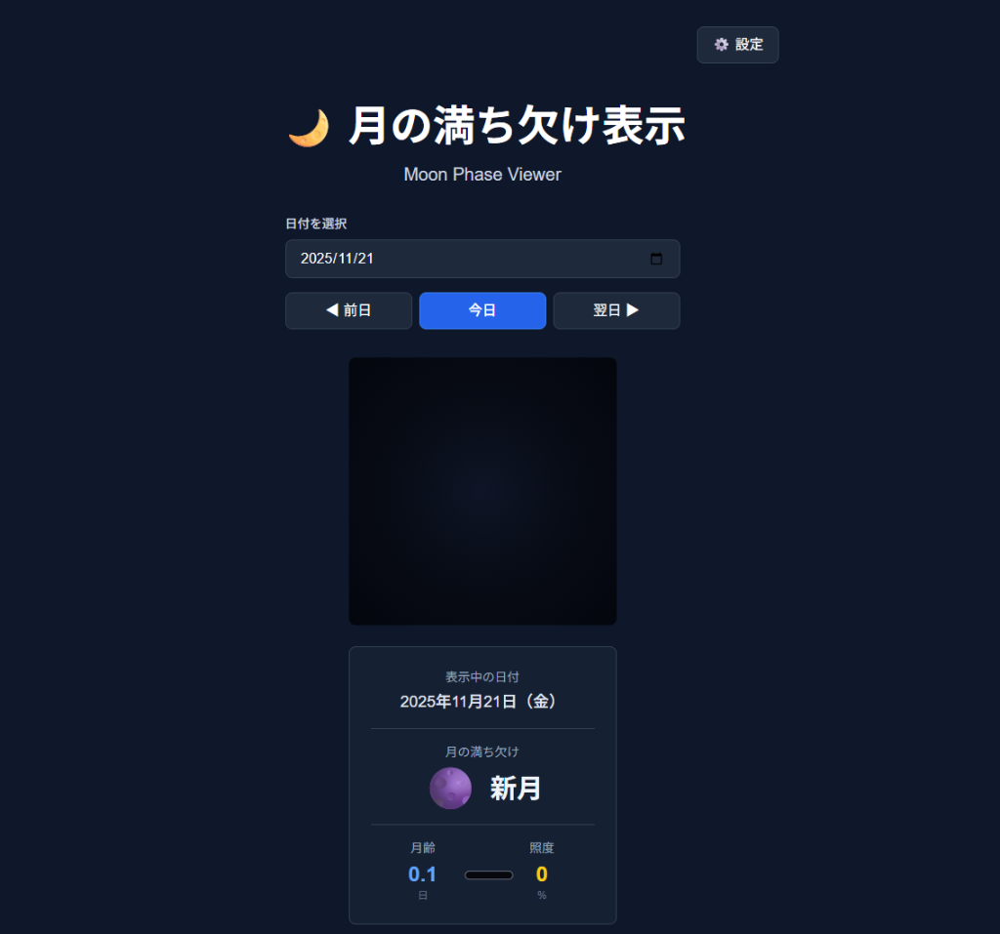

<a name="readme-top"></a>

<!-- PROJECT SHIELDS -->
[![Next.js][nextjs-shield]][nextjs-url]
[![TypeScript][typescript-shield]][typescript-url]
[![Tailwind CSS][tailwind-shield]][tailwind-url]
[![PWA][pwa-shield]][pwa-url]
[![MIT License][license-shield]][license-url]

<!-- PROJECT LOGO -->
<br />
<div align="center">
  <h1 align="center">🌙 Moon Phase Viewer</h1>

  <p align="center">
    月の満ち欠けを美しく表示し、AIで生成された情報を提供するPWAアプリケーション
    <br />
    <br />
    <a href="#usage">View Demo</a>
    ·
    <a href="https://github.com/takamiya1021/app031-moon-phase/issues">Report Bug</a>
    ·
    <a href="https://github.com/takamiya1021/app031-moon-phase/issues">Request Feature</a>
  </p>
</div>

<!-- TABLE OF CONTENTS -->
<details>
  <summary>Table of Contents</summary>
  <ol>
    <li>
      <a href="#about-the-project">About The Project</a>
      <ul>
        <li><a href="#screenshots">Screenshots</a></li>
        <li><a href="#features">Features</a></li>
        <li><a href="#built-with">Built With</a></li>
      </ul>
    </li>
    <li>
      <a href="#getting-started">Getting Started</a>
      <ul>
        <li><a href="#prerequisites">Prerequisites</a></li>
        <li><a href="#installation">Installation</a></li>
        <li><a href="#api-key-setup">API Key Setup</a></li>
      </ul>
    </li>
    <li><a href="#usage">Usage</a></li>
    <li><a href="#moon-phase-calculation">Moon Phase Calculation</a></li>
    <li><a href="#visual-features">Visual Features</a></li>
    <li><a href="#testing">Testing</a></li>
    <li><a href="#deployment">Deployment</a></li>
    <li><a href="#project-structure">Project Structure</a></li>
    <li><a href="#license">License</a></li>
    <li><a href="#contact">Contact</a></li>
    <li><a href="#acknowledgments">Acknowledgments</a></li>
  </ol>
</details>

<!-- ABOUT THE PROJECT -->
## About The Project

Moon Phase Viewerは、天文学的に正確な月齢計算と美しいビジュアル表現を組み合わせた、プログレッシブ・ウェブ・アプリケーション（PWA）です。200年間（1925年〜2125年）の月の満ち欠けを計算でき、オフラインでも動作します。

Google Gemini AIを統合することで、月の豆知識、占いメッセージ、観測のヒントなど、魅力的なコンテンツを自動生成します。

<p align="right">(<a href="#readme-top">back to top</a>)</p>

### Screenshots

<div align="center">
  
  <p><em>新月の表示例（月齢 0.1日）</em></p>
</div>

<p align="right">(<a href="#readme-top">back to top</a>)</p>

### Features

- 🌑🌒🌓🌔🌕 **Realistic Moon Phases** - 物理ベースの球体シャドウマスキングと縁暗化効果
- 📅 **200 Year Range** - 1925年〜2125年の月齢計算に対応
- 🤖 **AI-Generated Content** - Gemini 2.5 Flashによる豆知識・占い・観測ヒント生成
- 💾 **Offline First** - PWA対応で月齢計算はオフラインで動作
- 🎨 **Beautiful Dark UI** - 夜空をテーマにした美しいダークインターフェース
- 📱 **Fully Responsive** - デスクトップ、タブレット、モバイル対応
- 🎭 **Traditional Japanese Names** - 新月・三日月・上弦・十三夜・満月など伝統的な月の名称
- ⚡ **60fps Smooth Animations** - 最適化されたCanvas 2D描画

<p align="right">(<a href="#readme-top">back to top</a>)</p>

### Built With

**Frontend:**
* [![Next.js][nextjs-shield]][nextjs-url] - React Framework (App Router)
* [![TypeScript][typescript-shield]][typescript-url] - Type Safety
* [![Tailwind CSS][tailwind-shield]][tailwind-url] - Styling
* [![React][react-shield]][react-url] - UI Library

**AI \u0026 Services:**
* [![Google AI][google-ai-shield]][google-ai-url] - Gemini 2.5 Flash
* [![PWA][pwa-shield]][pwa-url] - Progressive Web App

**Testing:**
* [![Jest][jest-shield]][jest-url] - Unit Testing
* [![Playwright][playwright-shield]][playwright-url] - E2E Testing

<p align="right">(<a href="#readme-top">back to top</a>)</p>

<!-- GETTING STARTED -->
## Getting Started

### Prerequisites

* **Node.js 18+** and npm or pnpm
  ```sh
  node --version  # Check Node.js version
  npm --version   # Check npm version
  ```

### Installation

1. **Clone the repository**
   ```sh
   git clone https://github.com/takamiya1021/app031-moon-phase.git
   cd app031-moon-phase
   ```

2. **Install dependencies**
   ```sh
   npm install
   ```

3. **Run development server**
   ```sh
   npm run dev
   ```

4. **Open [http://localhost:3000](http://localhost:3000) in your browser**

<p align="right">(<a href="#readme-top">back to top</a>)</p>

### API Key Setup

AI機能を使用するには、Google AI Studio APIキーが必要です（オプション）。

1. [Google AI Studio](https://makersuite.google.com/app/apikey)でAPIキーを取得
2. アプリ内で「⚙️ Settings」をクリック
3. APIキーを入力して保存

> **Note**: APIキーがなくてもアプリは動作しますが、AI機能ではダミーデータが表示されます。

<p align="right">(<a href="#readme-top">back to top</a>)</p>

<!-- USAGE -->
## Usage

### 基本的な使い方

1. **日付を選択**: カレンダーで任意の日付を選択（1925年〜2125年）
2. **月の表示**: リアルタイムで月の満ち欠けが視覚化されます
3. **詳細情報**: 月齢、照度、月の出入り時刻などを確認
4. **AI生成**: 「Generate」ボタンで豆知識や占いを生成（APIキー必要）

### Production Build

```bash
# Build for production
npm run build

# Start production server
npm start
```

### PWAとしてインストール

1. ブラウザで開く
2. アドレスバーの「インストール」ボタンをクリック
3. ホーム画面にアプリアイコンが追加されます

<p align="right">(<a href="#readme-top">back to top</a>)</p>

<!-- MOON PHASE CALCULATION -->
## Moon Phase Calculation

### Algorithm Details

- **基準日**: 2000年1月6日 18:14 UTC（既知の新月）
- **朔望周期**: 29.53058867日
- **対応範囲**: 1925年〜2125年（±100年）
- **精度**: 天文学的に正確な月齢計算

### 伝統的な月の名称

日本の伝統的な月の呼び名を使用しています：

| 月齢 | 名称 | 英語 |
|------|------|------|
| 0日前後 | 新月 | New Moon |
| 3日前後 | 三日月 | Crescent |
| 7日前後 | 上弦 | First Quarter |
| 13日前後 | 十三夜 | Waxing Gibbous |
| 15日前後 | 満月 | Full Moon |
| 19日前後 | 寝待月 | Waning Gibbous |
| 23日前後 | 下弦 | Last Quarter |
| 26日前後 | 有明月 | Waning Crescent |

<p align="right">(<a href="#readme-top">back to top</a>)</p>

<!-- VISUAL FEATURES -->
## Visual Features

### Canvas 2D Rendering

高品質な月の描画を実現するため、Canvas APIを使用しています：

- **球体シャドウマスキング** - 物理的に正確な影の計算
- **縁暗化効果（Limb Darkening）** - 自然な境界線の表現
- **調整可能なTerminator** - シャープながら滑らかな影の境界
- **カラーグレーディング** - 青みがかった白色の月（R: 0.85, G: 0.95, B: 1.2）
- **60fps アニメーション** - スムーズな視覚体験
- **レスポンシブサイズ** - 画面サイズに応じた自動調整

### Performance Optimization

- `willReadFrequently`フラグによる最適化
- 効率的なピクセル操作
- メモリ使用量の最小化

<p align="right">(<a href="#readme-top">back to top</a>)</p>

<!-- TESTING -->
## Testing

### Run Tests

```bash
# Run unit tests
npm test

# Run unit tests in watch mode
npm run test:watch

# Run E2E tests
npm run test:e2e
```

### Test Coverage

- ✅ **月齢計算**: 21 tests - 期待される月齢計算の精度を検証
- ✅ **Canvas描画**: 10 tests - 月の視覚表現の正確性を確認
- ✅ **UIコンポーネント**: 21 tests - コンポーネントの動作を検証
- ✅ **AIサービス**: 8 tests - API統合とエラーハンドリングをテスト
- ✅ **E2Eシナリオ**: 4 tests - エンドツーエンドのユーザーフローを検証

**Total: 64 tests** covering critical functionality

<p align="right">(<a href="#readme-top">back to top</a>)</p>

<!-- DEPLOYMENT -->
## Deployment

### Vercel (Recommended)

[](https://vercel.com/new/clone?repository-url=https://github.com/takamiya1021/app031-moon-phase)

1. GitHubにプッシュ
2. Vercelでプロジェクトをインポート
3. デプロイ（環境変数の設定不要）

### Other Platforms

Next.js 14をサポートする任意のプラットフォームで動作します：
- Netlify
- Cloudflare Pages
- AWS Amplify
- Railway

### Environment Variables

> **Important**: このアプリは`.env`ファイルを使用しません。APIキーはアプリ内の設定ページで管理され、localStorageに保存されます。

<p align="right">(<a href="#readme-top">back to top</a>)</p>

<!-- PROJECT STRUCTURE -->
## Project Structure

```
app031-moon-phase/
├── app/                      # Next.js App Router
│   ├── page.tsx              # メインページ
│   ├── layout.tsx            # ルートレイアウト
│   └── settings/             # 設定ページ
├── components/               # React コンポーネント
│   ├── MoonCanvas.tsx        # Canvas 2Dによる月の描画
│   ├── DateSelector.tsx      # 日付選択コンポーネント
│   ├── MoonInfo.tsx          # 月齢情報表示
│   ├── GenerateButton.tsx    # AI生成ボタン
│   └── AIContentSection.tsx  # AIコンテンツ表示
├── lib/                      # ユーティリティ
│   ├── moonPhase.ts          # 月齢計算ロジック
│   ├── aiService.ts          # Gemini API統合
│   └── storage.ts            # localStorage管理
├── hooks/                    # カスタムReact Hooks
├── e2e/                      # Playwright E2Eテスト
├── __tests__/                # Jestユニットテスト
├── public/                   # 静的アセット
│   ├── manifest.json         # PWA manifest
│   ├── icon-192.png          # PWA アイコン
│   └── moon_normal_map.png   # 月のノーマルマップ
└── doc/                      # ドキュメント
    ├── requirements.md       # 要件定義書
    ├── technical-design.md   # 技術設計書
    └── implementation-plan.md # 実装計画書
```

<p align="right">(<a href="#readme-top">back to top</a>)</p>

<!-- LICENSE -->
## License

Distributed under the MIT License. See `LICENSE` file for details.

<p align="right">(<a href="#readme-top">back to top</a>)</p>

<!-- CONTACT -->
## Contact

GitHub: [@takamiya1021](https://github.com/takamiya1021)

Project Link: [https://github.com/takamiya1021/app031-moon-phase](https://github.com/takamiya1021/app031-moon-phase)

<p align="right">(<a href="#readme-top">back to top</a>)</p>

<!-- ACKNOWLEDGMENTS -->
## Acknowledgments

- [NASA](https://www.nasa.gov/) - 月のテクスチャ提供
- [Google Gemini AI](https://ai.google.dev/) - AI機能を支える技術
- [Next.js Team](https://nextjs.org/) - 素晴らしいフレームワーク
- [Best-README-Template](https://github.com/othneildrew/Best-README-Template) - READMEテンプレート

<p align="right">(<a href="#readme-top">back to top</a>)</p>

---

**Made with 🌙 and ✨**

<!-- MARKDOWN LINKS & IMAGES -->
[nextjs-shield]: https://img.shields.io/badge/Next.js-14-black?style=for-the-badge&logo=next.js
[nextjs-url]: https://nextjs.org/
[typescript-shield]: https://img.shields.io/badge/TypeScript-5-blue?style=for-the-badge&logo=typescript
[typescript-url]: https://www.typescriptlang.org/
[tailwind-shield]: https://img.shields.io/badge/Tailwind_CSS-3-38B2AC?style=for-the-badge&logo=tailwind-css
[tailwind-url]: https://tailwindcss.com/
[pwa-shield]: https://img.shields.io/badge/PWA-Ready-orange?style=for-the-badge
[pwa-url]: https://web.dev/progressive-web-apps/
[license-shield]: https://img.shields.io/badge/License-MIT-yellow.svg?style=for-the-badge
[license-url]: https://github.com/takamiya1021/app031-moon-phase/blob/main/LICENSE
[react-shield]: https://img.shields.io/badge/React-18-61DAFB?style=for-the-badge&logo=react
[react-url]: https://reactjs.org/
[google-ai-shield]: https://img.shields.io/badge/Google_AI-Gemini-4285F4?style=for-the-badge&logo=google
[google-ai-url]: https://ai.google.dev/
[jest-shield]: https://img.shields.io/badge/Jest-30-C21325?style=for-the-badge&logo=jest
[jest-url]: https://jestjs.io/
[playwright-shield]: https://img.shields.io/badge/Playwright-1.56-2EAD33?style=for-the-badge&logo=playwright
[playwright-url]: https://playwright.dev/
